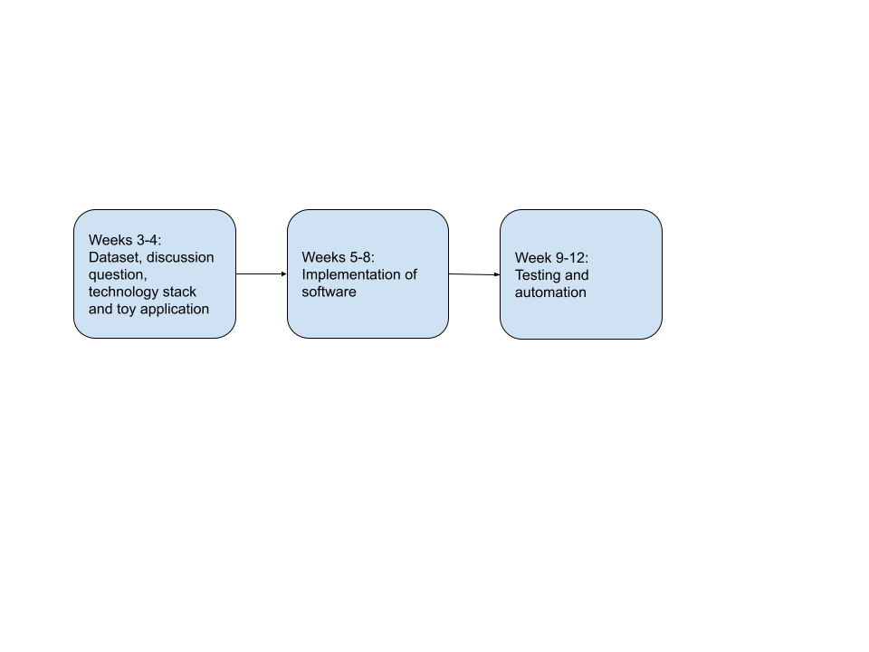

# Roadmap: Preliminary Project Development Plan

To preface the roadmap outlined below, it is important to note that we will be updating our README.md in the root directory of our GitHub repository when our code gets updated with new dependencies. Once the initial toy application gets pushed, we will also immediately containerise it, enabling it the application to be ran on multiple operating systems and environments. Meeting notes will also be taken throughout the weeks and pushed to the repository when appropriate.
|  | 
| :--: |
| *Project Roadmap* | 

### 1. Weeks 3-4: Dataset, discussion question, technology stack and toy application
- Drawing from our personal experiences and interests, we will settle on a theme/topic interesting to all of us.
-  To find reliable and consistent datasets, we will scrape websites like Kaggle which hosts a variety of large datasets.
-  From there, we will brainstorm potential high impact questions to explore given our selected dataset and theme.
-  On top of that, how we achieve that outcome is important too. Particularly, the technology stack we use and why we have reached that decision.Some facets to consider are as follows, though not exhaustive:
    - Language
    - Popularity i.e examples of long-lived projects using the same stack
    - Toolchain
    Containers
-  Creating a toy application and containerising it so that it can run on
       multiple OS
### 2. Weeks 5-8: Implementation of software
-  Once we have confirmed our data source and chosen technology stack, we will begin to write code that helps us achieve our discussion question via:
    - Containerising software
    - Data exploration
    - Data analysis
    - Machine learning algorithms
    - Data visualization of interesting/meaningful result
    - Improving user interface
- We will also continuously update our GitHub repository and the README.md as we add new dependencies and features.

### 3. Weeks 9-12: Testing and Automation
-  Once our software is complete, we will come up with various test cases in an attempt to catch bugs and ensure the robustness of our software.
-  Furthermore, we would think of ways to automate our tool to ensure a good user experience.
-  These changes would be documented and be uploaded to our GitHub repository

